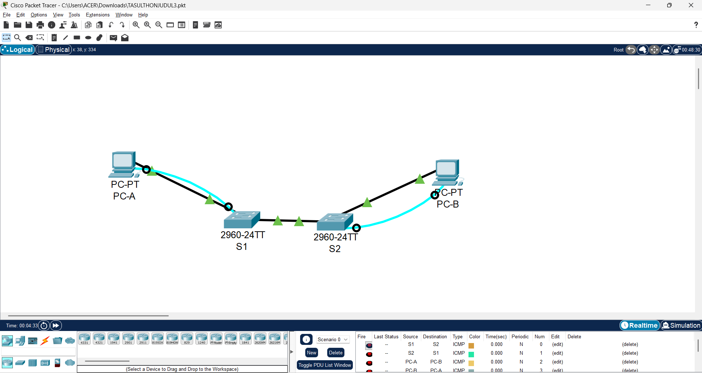
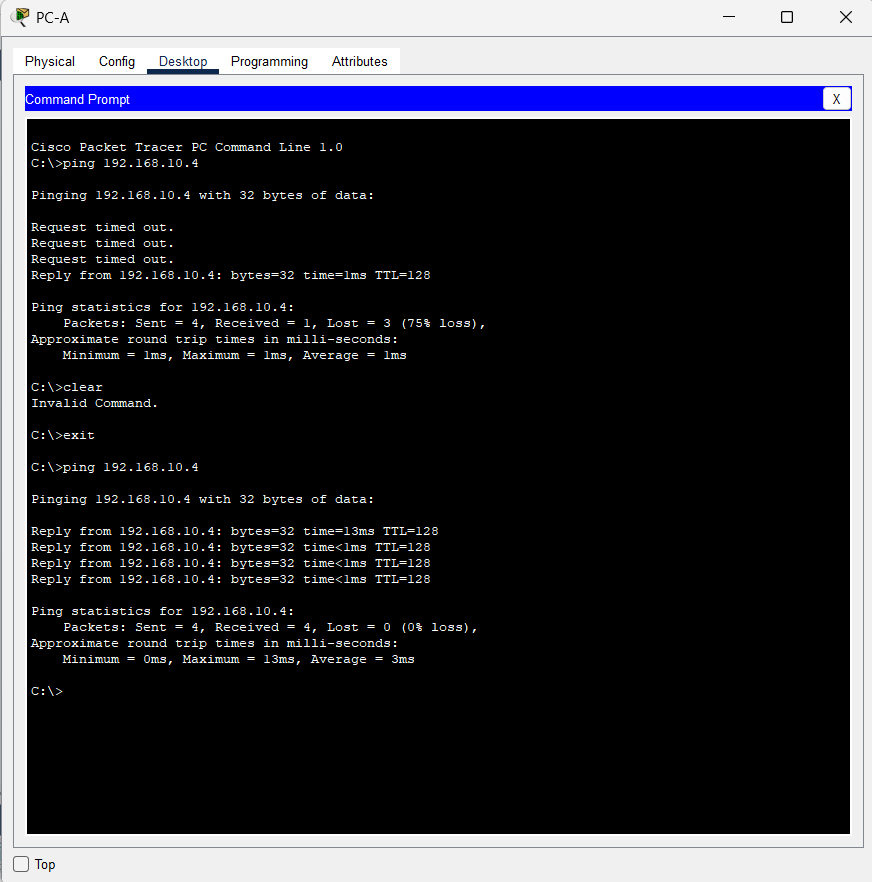

# 🧩 Tugas Akhir Praktikum Jaringan Komputer Judul 3

## **3.4.6 Lab – Configure VLANs and Trunking**

---

### 🎥 Video Penjelasan:

**[Klik di sini untuk menonton di YouTube](https://youtu.be/uXpsaA8i6ww)**

---

### 📘 Deskripsi Singkat

Proyek ini merupakan implementasi dari **Lab 3.4.6 – Configure VLANs and Trunking** menggunakan **Cisco Packet Tracer (Physical Mode)**.
Tujuannya adalah untuk membangun jaringan antar dua switch dengan konfigurasi **VLAN dan Trunking**, sehingga host dalam VLAN yang sama dapat saling berkomunikasi meskipun berada di switch yang berbeda.

---

### 🏗️ Topologi Jaringan

[PC-A] ── [S1] ⇄ [S2] ── [PC-B]

---

### 📋 Addressing Table

| Device   | Interface | IP Address   | Subnet Mask   | Default Gateway |
| -------- | --------- | ------------ | ------------- | --------------- |
| **S1**   | VLAN 1    | 192.168.1.11 | 255.255.255.0 | N/A             |
| **S2**   | VLAN 1    | 192.168.1.12 | 255.255.255.0 | N/A             |
| **PC-A** | NIC       | 192.168.10.3 | 255.255.255.0 | 192.168.10.1    |
| **PC-B** | NIC       | 192.168.10.4 | 255.255.255.0 | 192.168.10.1    |

---

### ⚙️ Konfigurasi Singkat

#### **Switch S1**

```
enable
conf t
hostname S1
no ip domain-lookup
enable secret class
service password-encryption
banner motd $ Authorized Users Only! $

interface vlan 1
 ip address 192.168.1.11 255.255.255.0
 no shutdown

vlan 10
 name Operations
vlan 20
 name Parking_Lot
vlan 99
 name Management
vlan 1000
 name Native

interface f0/6
 switchport mode access
 switchport access vlan 10

interface range f0/11-24
 switchport mode access
 switchport access vlan 99

interface f0/1
 switchport mode trunk
 switchport trunk native vlan 1000

exit
copy run start
```

#### **Switch S2**

```
enable
conf t
hostname S2
no ip domain-lookup
enable secret class
service password-encryption
banner motd $ Authorized Users Only! $

interface vlan 1
 ip address 192.168.1.12 255.255.255.0
 no shutdown

vlan 10
 name Operations
vlan 20
 name Parking_Lot
vlan 99
 name Management
vlan 1000
 name Native

interface f0/18
 switchport mode access
 switchport access vlan 10

interface f0/1
 switchport mode trunk
 switchport trunk native vlan 1000

exit
copy run start
```

---

### 🔍 Verifikasi

Gunakan perintah berikut untuk memverifikasi konfigurasi VLAN dan trunking:

```
show vlan brief
show interfaces trunk
show ip interface brief
```

Lakukan **ping antar host**:

* Dari PC-A ping ke PC-B ✅
* Dari PC-A ke S1 ❌ (beda VLAN)
* Dari PC-B ke S2 ❌ (beda VLAN)

---

### 📸 Dokumentasi

**🖥️ Topologi Packet Tracer**


**📶 Hasil Ping Berhasil (PC-A ke PC-B)**


**📶 Hasil Ping VLAN Management**


**⚙️ Tampilan Trunking**


---

### 💡 Kesimpulan

* VLAN berhasil dibuat dan dihubungkan melalui **trunk port F0/1** antar switch.
* Host dalam VLAN 10 dapat berkomunikasi meskipun berada pada switch berbeda.
* VLAN 99 digunakan sebagai **VLAN Management**, dan VLAN 1000 sebagai **Native VLAN**.
* Trunking memungkinkan efisiensi dan keamanan jaringan dengan segmentasi yang lebih baik.

---

### 👨‍💻 Identitas

Nama: M Sulthon Alfarizky

NPM: 2315061054

Kelas: PJK A

---
